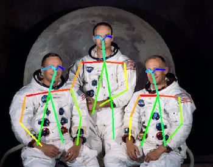
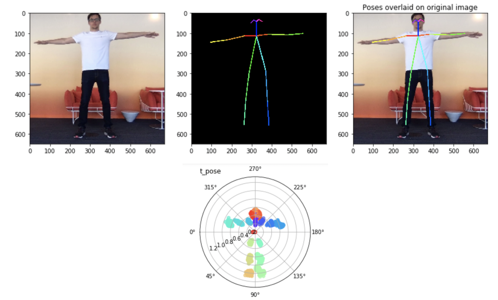
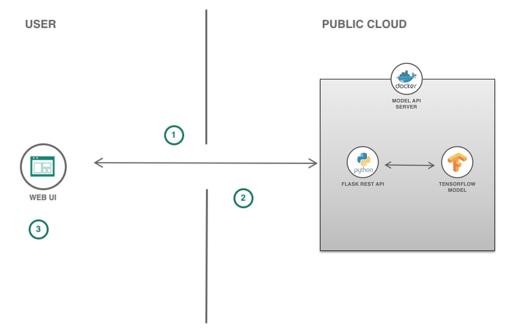

# Yogait

Build a web application that recognizes yoga poses using a model from the [Model Asset Exchange](https://developer.ibm.com/exchanges/models/all/max-human-pose-estimator/).

# IBM Developer Model Asset Exchange: Human Pose Estimator Demo

Yogait is a yoga assistant that uses the Human Pose Estimator MAX Model to guess which yoga pose a user is performing.
The MAX model is deployed to a local server which performs inference and returns the pose guess to the client application.

# Authors
* Collin Abidi <cba15@pitt.edu>
* Daniel Jalova <djalova@us.ibm.com>

# URLs

**Pattern Github Repo**
* https://github.com/IBM/yogait

**MAX Model Github Repo**
* https://github.com/IBM/MAX-Human-Pose-Estimator


# Summary

In this code pattern, we will create an interactive web application that uses the webcam to recognize the user's yoga poses.

## Included Components

* [IBM Model Asset Exchange](https://developer.ibm.com/exchanges/models/): A place for developers to find and use
free and open source deep learning models.
* [Docker](https://www.docker.com): Docker is a tool designed to make it easier to create, deploy, and run applications
by using containers.


## Featured Technologies

* [Python](https://www.python.org/): Python is a programming language that lets you work more quickly and integrate
your systems more effectively.
* [JQuery](https://jquery.com): jQuery is a cross-platform JavaScript library designed to simplify the client-side
scripting of HTML.
* [Bootstrap 3](https://getbootstrap.com): Bootstrap is a free and open-source front-end library for designing websites
and web applications.

# Description

The Human Pose Estimator model detects humans and their poses in a given image. The model first detects the humans in
the input image and then identifies the body parts, including nose, neck, eyes, shoulders, elbows, wrists, hips, knees,
and ankles. Next, each pair of associated body parts is connected by a "pose line"; for example, as the following image
shows, a line may connect the left eye to the nose, while another may connect the nose to the neck.



Each pose line is represented by a list [x1, y1, x2, y2], where the first pair of coordinates (x1, y1) is the start
point of the line for one body part, while the second pair of coordinates (x2, y2) is the end point of the line for the
other associated body part. The pose lines are assembled into full body poses for each of the humans detected in the
image.

The model is based on the TF implementation of [OpenPose model](https://github.com/ildoonet/tf-pose-estimation).
The code in this repository deploys the model as a web service in a Docker container. This repository was developed
as part of the [IBM Developer Model Asset Exchange](https://developer.ibm.com/exchanges/models/).

Yogait uses a pre-trained SVM to classify poses. Instead of using the Cartesian lines that the MAX model returns, Yogait
uses a Polar representation to perform classification. This was done to make it much easier to classify poses. Instead of 
training the SVM on a x-y coordinate system, which would require translation and rotation when augmenting data, the polar 
representation relies only upon the location of the joints relative to the center of the estimated model.

The [x,y] coordinates are converted to [phi, rho] for each joint.



The SVM performs classification on a flattened version of the polar vectors. Compared to a Cartesian representation, this polar representation uses very little data and can perform classification on 
a human in any part of a captured frame. If the Cartesian representation was to be used, then the user would have to perform
all poses in the center of the camera frame.

When the reader has completed the Code Pattern, they will understand how to:

* Build a Docker image of the Human Pose Estimator MAX Model
* Deploy a deep learning model with a REST endpoint
* Generate a pose estimation for a person in a frame of video using the MAX Model's REST API
* Run a web application that using the model's REST API

# Yogait Flow



1. Server sends the captured video frame-by-frame from the webcam to the Model API.
2. Web UI requests the pose lines estimated for the frame from the Server.
3. Server receives data from the Model API and updates the result to the Web UI.

Yogait can be run either in the Jupyter notebook (demo.ipynb) or by running the scripts. You can run Yogait with either a 
pre-trained model (located at /assets/classifier.pkl) or retrain it on your own data.

# Steps

## Using Web App

#### Setting up the MAX Model

1. [Deploy the Model](#1-deploy-the-model)
2. [Experimenting with the API (Optional)](#2-experimenting-with-the-api-optional)

#### Starting the Web App

1. [Check out the code](#1-check-out-the-code)
2. [Installing dependencies](#2-installing-dependencies)
3. [Running the server](#3-running-the-server)

#### Running Local Python Script

1. [Check out the python code](#1-check-out-the-python-code)
2. [Performing live inference](#2-performing-live-inference)
3. [Retraining the SVM](#3-retraining-the-svm)

#### Using Jupyter Notebook

1. [Run Jupyter Notebook](#1-run-jupyter-notebook)
2. [Explore and Train](#2-explore-and-train)

### Setting up the MAX Model

> NOTE: The set of instructions in this section are a modified version of the one found on the
[Human Pose Estimator Project Page](https://github.com/IBM/MAX-Human-Pose-Estimator)

#### 1. Deploy the Model

To run the docker image, which automatically starts the model serving API, run:

    docker run -e CORS_ENABLE=true -e WERKZEUG_RUN_MAIN=true -it -p 5000:5000 codait/max-human-pose-estimator

This will pull a pre-built image from Docker Hub (or use an existing image if already cached locally) and run it.
If you'd rather build the model locally you can follow the steps in the
[model README](https://github.com/IBM/MAX-Human-Pose-Estimator/blob/master/README.md#steps).

_Note_ that currently this docker image is CPU only (we will add support for GPU images later).

#### 2. Experimenting with the API (Optional)

The API server automatically generates an interactive Swagger documentation page.
Go to `http://localhost:5000` to load it. From there you see the API with the test requests.

Use the `model/predict` endpoint to load a test file and get estimated pose lines for the image from the API.

The [samples folder](https://github.com/IBM/MAX-Human-Pose-Estimator/tree/master/samples)
contains images you can use to test out the API, or you can use your own.

You can also test it on the command line, for example:

    curl -F "image=@path/to/pose.jpg" -X POST http://localhost:5000/model/predict

```
{
  "status": "ok",
  "predictions": [
    {
      "human_id": 0,
      "pose_lines": [
        {
          "line": [
            444,
            269,
            392,
            269
          ]
        },

        ...

        {
          "line": [
            439,
            195,
            464,
            197
          ]
        }
      ],
      "body_parts": [
        {
          "part_id": 0,
          "part_name": "Nose",
          "score": "0.83899",
          "x": 428,
          "y": 205
        },

        ...

        {
          "part_id": 17,
          "part_name": "LEar",
          "score": "0.81776",
          "x": 464,
          "y": 197
        }
      ]
    },

    ...

  ]
}
```

### Starting the Web App

#### 1. Check out the code

Clone the Yogait repository locally by running the following command:
```bash
git clone https://github.com/IBM/yogait
```

Then change directory into the local repository
```bash
cd yogait
```

#### 2. Installing dependencies

The general recommendation for Python development is to use a virtual environment [(venv)](https://docs.python.org/3/tutorial/venv.html). To install and initialize a virtual environment, use the `venv` module on Python 3 (you install the virtualenv library for Python 2.7):

```bash
# Create the virtual environment using Python. Use one of the two commands depending on your Python version.
# Note, it may be named python3 on your system.

$ python -m venv mytestenv       # Python 3.X
$ virtualenv mytestenv           # Python 2.X

# Now source the virtual environment. Use one of the two commands depending on your OS.

$ source mytestenv/bin/activate  # Mac or Linux
$ ./mytestenv/Scripts/activate   # Windows PowerShell
```

Before running this web app you must install its dependencies:

```bash
pip install -r requirements.txt
```

> **TIP** :bulb: To terminate the virtual environment use the `deactivate` command.


#### 3. Running the server

You need to install the dependencies first:
```bash
cd web
npm install
```
You then start the web app by running:
```bash
node app.js
```
You can then access the web app at: [`http://localhost:3000`](http://localhost:3000)

The Human Pose Estimator endpoint must be available at `http://localhost:5000` for the web app to successfully start.


### Running Local Python Script

#### 1. Check out the python code

All of the python scripts are located in the main folder.

`helpers.py` and `data.py` contain helper functions for the rest of the code
  
`train.py` retrains the SVM on the folders and images located in the `assets/images` folder
    
`inference.py` runs a live inference demo that uses the deployed Docker image to estimate live poses

#### 2. Performing Live Inference

You then start the live inference demo by running:

    python inference.py

You can then view live pose estimation in a window and predictions from the SVM in the terminal.

The Human Pose Estimator endpoint must be available at `http://localhost:5000` for the web app to successfully start.


#### 3. Retraining the SVM

You can retrain the SVM on your own poses by adding images and folders to assets/images. Images of the same class must be in the same folder and must be .png, .jpeg, or .jpg filetypes.
  
You can then retrain the SVM on the updated classes by running:

    python train.py
    
### Using Jupyter Notebook

#### 1. Run Jupyter Notebook

Once the model server is running, you can see how to use it by walking through [the demo notebook](demo.ipynb). _Note_ the demo requires `jupyter`, `numpy`, `matplotlib`, `opencv-python`, `json`, and `requests`.

Run the following command from the model repo base folder, in a new terminal window (leaving the model server running in the other terminal window):

    jupyter notebook


This will start the notebook server. You can open the simple demo notebook by clicking on `demo.ipynb`.

#### 2. Explore and Train

Inside the notebook, you can load and visualize the data. By following the steps in the notebook, you can retrain the SVM and visualize how well the data classes separate by running PCA.

# Links

* [Model Asset eXchange (MAX)](https://developer.ibm.com/exchanges/models/)
* [Center for Open-Source Data & AI Technologies (CODAIT)](https://developer.ibm.com/code/open/centers/codait/)
* [MAX Announcement Blog](https://developer.ibm.com/code/2018/03/20/igniting-a-community-around-deep-learning-models-with-model-asset-exchange-max/)

# Learn More

* **Artificial Intelligence Code Patterns**: Enjoyed this Code Pattern? Check out our other
[Artificial Intelligence Code Patterns](https://developer.ibm.com/technologies/artificial-intelligence/)
* **AI and Data Code Pattern Playlist**: Bookmark our
[playlist](https://www.youtube.com/playlist?list=PLzUbsvIyrNfknNewObx5N7uGZ5FKH0Fde) with all of our Code Pattern videos
* **Watson Studio**: Master the art of data science with IBM's [Watson Studio](https://dataplatform.cloud.ibm.com/)
* **Deep Learning with Watson Studio**: Design and deploy deep learning models using neural networks, easily scale to
hundreds of training runs. Learn more at [Deep Learning with Watson Studio](https://www.ibm.com/cloud/deep-learning).

# License
This code pattern is licensed under the Apache Software License, Version 2.  Separate third party code objects invoked within this code pattern are licensed by their respective providers pursuant to their own separate licenses. Contributions are subject to the [Developer Certificate of Origin, Version 1.1 (DCO)](https://developercertificate.org/) and the [Apache Software License, Version 2](https://www.apache.org/licenses/LICENSE-2.0.txt).

[Apache Software License (ASL) FAQ](https://www.apache.org/foundation/license-faq.html#WhatDoesItMEAN)
